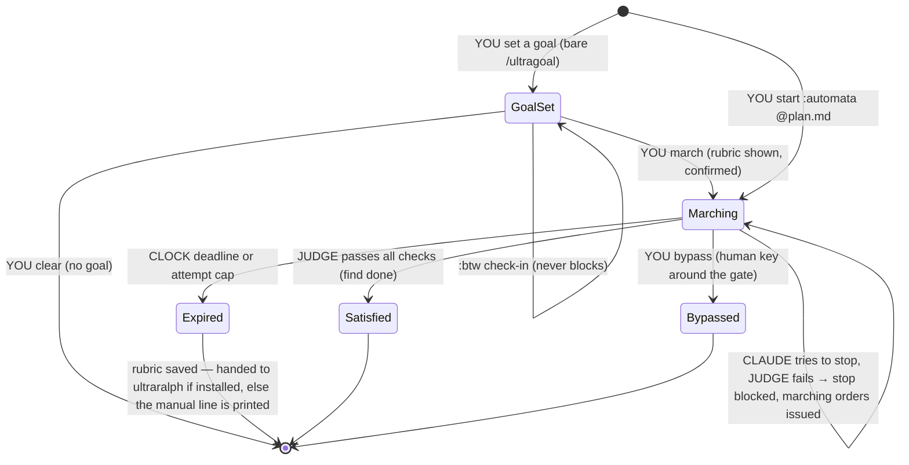

# ultragoal — namespace and semantics

Design note from the 2026-08-09 ideation (operator gulp × claude-fable-5,
session `fe94f609-9b09-448b-9f14-75cdac58d625`). Supersedes the naming in
`docs/plans/goal-automata-plugin.md` (mechanism there still stands); the
plugin **goal-automata is renamed ultragoal**. Every ruling below was made
explicitly in that session; nothing here is provisional except the one item
in *Open*.

## Why "ultragoal"

Anthropic's ultra\* family (ultrathink, `/code-review ultra`, ultracode) has
one consistent meaning: **an explicit opt-in to spend more**. ultragoal joins
that family honestly — you are opting into enforcement spend. The original
name survives inside the namespace: `/ultragoal:automata` reassembles
"goal-automata" across the namespace joint.

## Namespace

The plugin ships exactly **three** listed skills. Verbs are positional
arguments on the front door, never sub-skills — gh-style, visible in the
terminal as you type, no namespace explosion.

```
/ultragoal            interactive front door — knows state, answers briefly,
                      hints the next verb; mutates NOTHING unless asked
  start @plan.md      ignite :automata with a plan        → marching
  march               upgrade a set goal into enforcement → marching
  status              where am I
  bypass              human key around the gate           → bypassed
  clear               un-set a set goal                   → no goal
/ultragoal:automata   the mode skill — a different arming ceremony
                      (plan → hash-pinned rubric, bounded judge)
/ultragoal:btw        non-blocking check-in — reports status, offers
                      march/clear, never gates anything
```

`:automata` is a skill because it is a different *ceremony*; `:btw` is a
skill because it is a different *interaction contract* (never blocks).
Everything else is a verb.

**Rejected names, with reasons** (kept so they are not re-litigated):
- `:karpathy` / `:autoresearch` — ultragoal is an automaton, not research.
  Karpathy is credited in `:automata`'s description ("after Karpathy's
  autoresearch recipe" — provenance: the vault's
  `raw/x/karpathy-autoresearcher.json`, and
  `docs/plans/goal-automata-plugin.md:20,120 which cites autoresearch and
  bakes in his simplicity criterion verbatim`). Skill frontmatter has no
  alias field; the description word is what makes fuzzy/NL invocation
  resolve.
- **keeper** (and every persona noun) — overloaded meaning for non-native
  speakers (goalkeeper / zookeeper / gatekeeper / "a keeper"). Don't make
  them think. ultragoal is the noun; verbs carry the semantics.
- The soccer metaphor entirely (saves, clean sheets, conceding) — same
  ruling.
- `:naive` for the sibling's bare rung — it editorializes against the tool.
- `arm` / `release` — replaced by CC-native muscle memory (below).

## Verbs

| verb | provenance | semantics |
|---|---|---|
| `start` | gh-style ignition | arm `:automata` with a plan file. Deliberately **not** `ready` — beads' `br ready` is queue semantics ("unblocked, waiting for a worker"); if ultragoal ever grows a queue of pending rubrics, *that* is where `ready` vocabulary belongs. |
| `status` | CC-native (`/status`) | read-only, always safe |
| `march` | the plugin's own idiom | upgrade a set goal into enforcement. Compiles the goal sentence into a rubric, **shows the compile, binds only on confirm** (weaker provenance than a plan file — the rubric derives from a possibly-drifted conversation, so it must show its work). Spend starts here. There is no `demote`; the only way down is `bypass`. gh analogy for the docs: `march` is `gh pr ready` — same object, upgraded state. |
| `bypass` | CC-native (*bypass permissions*) | the human key: you deliberately go **around** the gate, on your own authority. The audit trail reads "bypassed", which is the truth. (Replaced `release`, which wrongly implied the gate let go.) |
| `clear` | CC-native (`/clear`) | wipe a **set** goal, no ceremony. `clear` and `bypass` are never both valid: one word per state — `clear` works only on a set goal, `bypass` only while marching. |

Cross-plugin convention (stated once, reused by the suite): **you arm
enforcers and observers; work is never "armed."** dumbzone arms a watcher,
agent-mail arms a monitor, ultragoal arms a gate.

## States



Naming rules, both load-bearing:

1. **Grammar encodes liveness.** Live states are present participles
   (*marching*); terminal states are past participles (*satisfied,
   bypassed, expired*). `goal set` is the parked entry state; `clear`
   produces no state at all (`status` says "no goal").
2. **Machine enums never surface.** `ESCALATED` may exist in code; the human
   reads "expired — handed to ultraralph" or "expired — rubric saved at X".
   (Same rule killed `Released`, a fossil of the dead `release` verb, and
   `Blocked`, which was never a state — a blocked stop is a self-loop
   *event* on marching: "stop blocked, marching orders issued".)

**Each actor owns exactly one kind of arrow.** YOU own every left-side
transition and the human key; CLAUDE owns only "tries to stop" — it can
never move the state anywhere else; the JUDGE owns pass/fail against disk
(never the model's opinion of itself); the CLOCK owns expiry. The
marching→marching rebound is the product; everything else is entrances and
exits.

## Terminal semantics — "find done"

**Ruled: `satisfied` is terminal.** Green closes the ticket. No
satisfied-pending-ratification state, no review pile. This is a deliberate
position in the content-state-trust vs human-review-as-canon question that
the operator's place-commons charter parks at project scale — ultragoal is
small enough to *be* the experiment, and the operator chose "find done."

### Backstory (kept per operator request; credit: claude-fable-5, session fe94f609)

> It's 3am. Everything went green while you slept. When you sit down
> tomorrow with your coffee — do you want to find *done*, or *ready for
> you*? "Done" means green tests close the ticket and your morning starts
> on new work — faster, and honest exactly as often as the judge is.
> "Ready for you" means the gate lets the session go home but stamps the
> outcome unratified — your morning starts with a review pile, and nothing
> your judge hallucinated ever becomes canon without your eyes on it.

The operator answered **find done**.

## The sibling: ultraralph

> **2026-08-09, same session, later:** the ultraralph↔ralph-this overlap is
> resolved in `ultraralph-ultraloop-destiny.md` — the engine is named
> **ultraloop**, ultraralph is a thin plugin over it (adopt-if-present bed,
> self-contained escalation mode), and the Karpathy improvement verb moves
> into ultragoal as `start --iterate N`. The mechanism below stands; read
> the destiny note before building.

Ruled: **no `:ralph` rung inside ultragoal.** Escalation crosses a plugin
boundary to a sibling (aligns with the existing ultraralph-first v0.3
bundle work):

```
/ultraralph:vanilla                the original loop — fresh session per
                                   attempt, rubric as prompt spine
                                   (Geoff Huntley credited in the
                                   description, not the namespace — same
                                   rule as karpathy)
/ultraralph:with-beads             rubric AC → bead decomposition, adjudicated
/ultraralph:with-beads --swarm N   hook-fed swarm eating the beadset
                                   (session.idle IS the loop; K=1 per bead)
```

**The seam is a file, not a call.** On expiry, ultragoal writes an
escalation record (hash-pinned rubric + attempt ledger) to a well-known
path. If `start`/`march` was given `--escalate`, ultraralph picks it up;
otherwise ultragoal prints the manual `/ultraralph:vanilla start @<record>`
line. No import in either direction; a human can hand-edit the rubric
between the plugins — which is exactly the authority checkpoint "find done"
gave away at the low end.

**Suite convention founded here: ultra\* plugins are standalone,
soft-coupled through `doctor` (presence checks) and files (seams), never
imports.** `ultragoal doctor` reports "escalation available: ultraralph
installed / not installed — the expiry path ends at a saved rubric without
it."

Safety precondition: the ralph-fix HIGH-sec items (egress tier default,
agent-writable verify.cmd) land before `--swarm` runs unattended.

## Telemetry (deferred, tracked)

ultragoal's countable events (stop-blocked, satisfied, bypassed, expired)
fit fleetglass's graded snapshot schema as a possible new kind. Transport
lean: ultragoal writes state files; fleetglass's watcher reads them (its
C1: read stores, instrument nothing). First non-numbers kind — needs one
deliberate paragraph in the fleetglass plan before it exists.

## The goal-set exit nudge (ruled 2026-08-09: "set to go")

When a session with a **goal set** (not marching) tries to stop, the nudge
mirrors the goal back **and offers `march` inline**: "you said X — done?
(`march` to enforce · `clear` to drop)". The stop is always allowed — a set
goal never gates — but the bare tier is the ladder's on-ramp, teaching that
enforcement is one word away. Self-grading was rejected outright (the
operator's own ablation work shows models grading their own output is the
judge you can't trust).

## Migration checklist (when the rename executes)

- Marketplace entry `goal-automata` → `ultragoal`; **bump `version`** (the
  subdir-source cache trap is documented in CLAUDE.md and enforced by
  `scripts/plugin-version-guard`).
- **Remove the `ultraralph` verb from the renamed skill and relocate
  `references/ultraralph-prompt.md` in the same change** — it becomes
  `/ultragoal start --iterate N` (ruled 2026-08-09, destiny note Ruling 4).
  Shipping the rename without this ships the ultraralph name collision
  (improve-after-success vs escalate-after-failure) into the marketplace.
- Check for a shadowing personal skill under `~/.claude/skills/` before
  publish (a stale `goal-automata` copy shadowed the plugin once already,
  2026-08-09).
- `:automata` description carries the Karpathy credit; `:vanilla` (in
  ultraralph) carries the ghuntley credit.
- Statechart source: this file's mermaid block is canonical.

## External evidence: prime-agent (read 2026-08-09)

PrimeIntellect-ai/prime-agent ships the vertically-integrated version of this
ladder (`/goal` ↔ ultragoal, `/autonomous` + gate commands ↔ ultraralph).
Two imports for this spec:

- **Self-grading contrast.** Their goal ends only when the *agent* calls
  `goal.complete()` — exactly the self-grading this spec rejected. Their own
  docs hedge it ("a passed gate checks only what that gate verifies; reaching
  a limit does not imply task success"), which is the honest form of the gap
  the external JUDGE closes. Keep the judge.
- **Seam-file completeness (feeds the ultraralph seam spec).** In prime-agent,
  goal state (objective, token/wall-clock accounting, continuation count) and
  the continuation policy talk **in-process**. Our seam is a file crossing a
  process boundary — so the rubric + attempt ledger must externalize the
  *spend accounting as well as the verdicts* (tokens/time consumed at
  handoff, budget remaining), or the downstream rung cannot honor the budget
  the upstream rung started. One mechanism worth copying into the iterate
  path: don't rerun a failed gate when the workspace hash is unchanged.

Vault companion: `wiki/prime-agent.md` (everything vault) carries the full
comparison.
